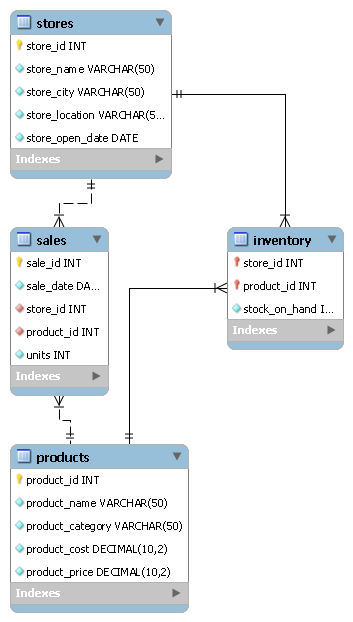

# Maven Toys SQL Analysis

## Overview

This project analyzes retail inventory and sales data using MySQL. It demonstrates database design, data validation, business-focused SQL analysis, and advanced SQL techniques to answer real-world business questions.

---

## Dataset

The project uses the Maven Toys retail dataset consisting of four tables:

- Products
- Stores
- Inventory
- Sales

---

## Database Schema



---

## Project Structure

```text
maven-toys-sql-analysis/
│
├── database/
│   ├── create_database.sql
│   ├── create_tables.sql
│   ├── data_import.sql
│   └── validation.sql
│
├── sql_queries/
│   ├── business_questions.sql
│   └── advanced_analysis.sql
│
├── dataset/
│
├── insights/
│   └── business_insights.md
│
├── images/
│
└── README.md
```

---

## SQL Concepts Covered

- Database Design
- Data Import
- Data Validation
- Joins
- Aggregate Functions
- Group By
- Having
- Subqueries
- Common Table Expressions (CTEs)
- CASE Expressions
- Window Functions
- ROW_NUMBER()
- RANK()
- DENSE_RANK()
- PARTITION BY

---

## Business Analysis

The project answers business questions related to:

- Inventory valuation
- Store performance
- Product performance
- Product category analysis
- Sales trends
- Inventory ranking
- Inventory distribution

---

## Repository Contents

| File | Description |
|------|-------------|
| create_database.sql | Creates the project database |
| create_tables.sql | Creates all tables and relationships |
| data_import.sql | Imports the dataset into MySQL |
| validation.sql | Validates imported data |
| business_questions.sql | Business-focused SQL queries |
| advanced_analysis.sql | Advanced SQL using CTEs and window functions |
| business_insights.md | Summary of key business findings |

---

## How to Run

1. Execute `create_database.sql`
2. Execute `create_tables.sql`
3. Update dataset paths in `data_import.sql`
4. Execute `data_import.sql`
5. Execute `validation.sql`
6. Run the SQL queries in the `sql_queries` folder

---

## Author

Venkkateshan

Data Analyst | SQL | Power BI | Python
